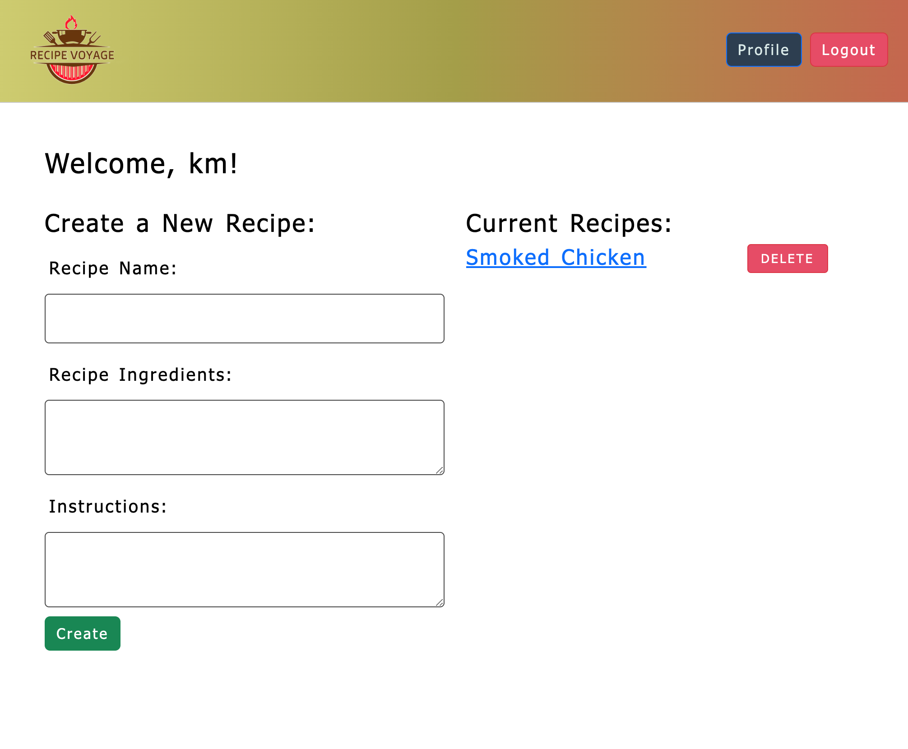

# Recipe Voyage 


## Description

Recipe Voyage provides a platform for users to share, discover, and save personal recipes as well as explore recipes from other users. It creates a community where culinary enthusiasts can connect, exchange ideas, and explore a world of delicious possibilities. Whether you're looking for new recipes to try or wanting to share your own culinary creations, Recipe Voyage offers a platform to connect with fellow food lovers and embark on a delightful culinary journey.
In our next version release, users will be able to comment on recipes and follow other users.

## Links
```
Github Link: https://github.com/oshkoshbagoshh/recipe-voyage
Heroku Link: https://recipevoyage-6c0c7512867d.herokuapp.com
```
## Screenshot



## Table of Contents

- [User Story](#user-story)
- [Installation](#installation)
- [Usage](#usage)
- [Authors](#authors)
- [Features](#features)
- [How to Contribute](#how-to-contribute)
- [Version History](#version-history)
- [License](#license)


## User Story
```
AS A USER of Recipe Voyage,
I WANT to save and organize my personal recipes,
SO THAT I can easily access and refer to them whenever I need to prepare a favorite dish.
```

## Installation

- To install the project, clone the repository from GitHub and run `npm install` in the root directory to install the dependencies.
- Run the SQL scripts
- Run `npm run seed` to seed the files
- Run `nodemon server.js` to start your localhost server

## Usage

- Test user accont info: 
  - email: yoooomn@suhd.com
  - password: 12345678


## Authors
- Karthik Murugappan: https://github.com/karthikmurugappan
- Alex Collin: https://github.com/acolin96
- Barry Engler: https://github.com/Barry25000
- AJ Javadi: https://github.com/oshkoshbagoshh


## Features
- User Authentication
- Sign Up
- Login/Logout
- MySQL Database
- ORM
- Getting Seed Data from ChatGPT
- Handlebars


## How to Contribute
- If you would like to contribute to this project, please contact one of the contributors.


## Version History
Version 1.0 (Initial Release)


## License
- This project is licensed under the MIT License - see the LICENSE.md file for details.